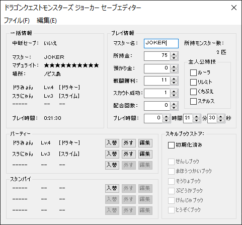
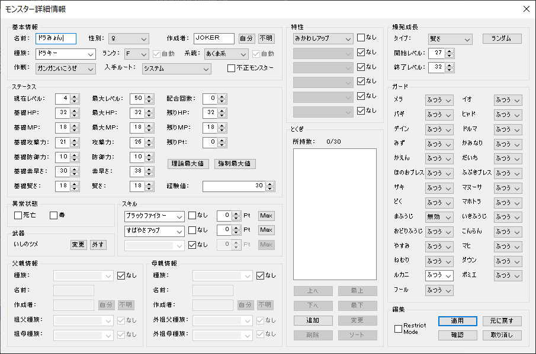
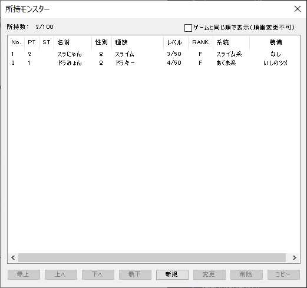
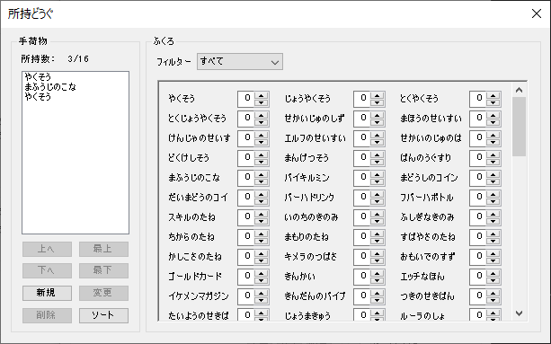
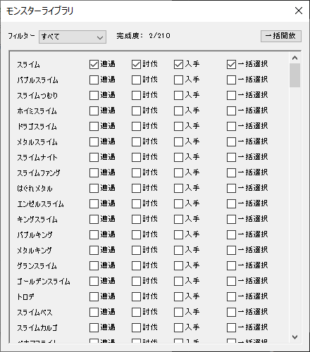
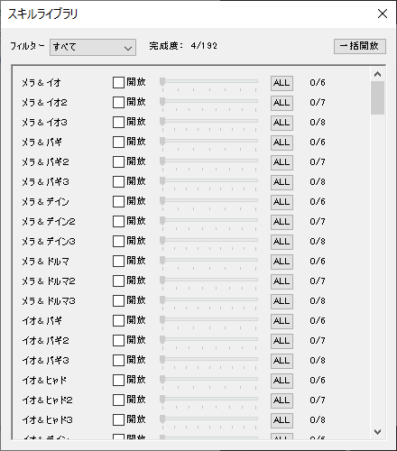

# dqmjse
A Japanese save editor for Dragon Quest Monsters: Joker for the Nintendo DS.

## Usage
* Install [Visual Studio](https://visualstudio.microsoft.com/)
* Open Visual Studio
    * Click on "Open a project or solution"
    * Select the `dqmjse.sln` file
    * Click on the hollow green Run arrow in the upper left toolbar (to the right of the text "Local Windows Debugger")

## Screenshots
### Monster editor

### Monsters list

### Inventory editor

### Monster library editor

### Skill library editor

